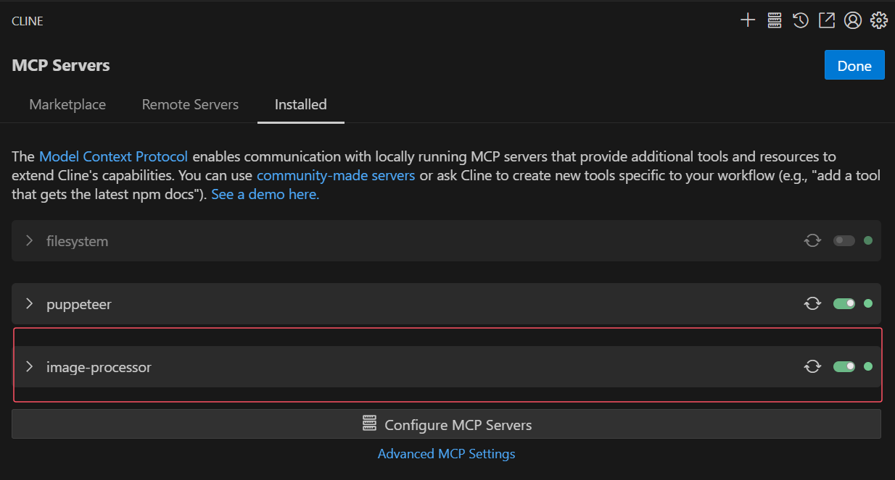

# MCP Image Processing Server


A high-performance image processing server based on the **Model Context Protocol (MCP)**, offering rich image processing features such as format conversion, resizing, compression, and optimization.

---

## Features Overview

- Supports multiple image format conversions: JPEG, PNG, WebP, TIFF, GIF, AVIF, HEIF
- Flexible image cropping and resizing
- Image quality compression and metadata removal optimization
- Multiple scaling modes, supporting maintaining or adjusting aspect ratio
- Rotation and horizontal/vertical flipping
- Brightness, contrast, saturation adjustment, as well as blur and sharpen post-processing

---

## System Requirements

- Node.js version 18 or higher
- TypeScript version 5 or higher
- Environment supporting native `sharp` module

---

## Installation & Quick Start

### 1. Clone the repository

```bash
git clone https://github.com/HYPERVAPOR/mcp-image-processor.git
cd mcp-image-processor
```

### 2. Install dependencies

```bash
npm install
```

### 3. (Optional) Modify the code

If you need to customize the MCP Server logic, edit `src/index.ts`. After modifications, run:

```bash
npm run build
```

### 4. Configure MCP Server

Using the `cline` client as an example (configuration for other clients like `cursor`, `cherryStudio` is similar):

```json
{
  "mcpServers": {
    "image-processor": {
      "autoApprove": [],
      "disabled": false,
      "timeout": 60,
      "command": "C:\\Program Files\\nodejs\\node.exe",
      "args": ["C:\\projs\\mcp-image-processor\\dist\\index.js"],
      "transportType": "stdio"
    }
  }
}
```

> **Note:** Please replace `command` and `args` with the actual paths on your machine.

### 5. Start using

Make sure the MCP Server is enabled:



Simply describe to the LLM what operations you want to perform on the image(s), providing one or more absolute image paths, for example:

```text
Please convert this image to black and white. The image is located at "C:\projs\MCP-image-server\assets\test\climbing.png"
```

Demo: 

---

## Available Tools & Interfaces

### 1. `image.convertFormat` — Format Conversion

- **Parameters**:

  - `imagesPath`: Array of absolute image paths
  - `outputFormat`: Target format (jpeg, png, webp, tiff, gif, avif, heif)
  - `formatParams` (optional):
    - `quality`: Output quality (0-100)
    - `compressionLevel`: Compression level (0-9, 9 is maximum)

- **Function**: Converts images to the specified format with optional quality and compression adjustments.

---

### 2. `image.cropResize` — Crop and Resize

- **Parameters**:

  - `imagesPath`: Array of absolute image paths
  - `width`: Target width in pixels (optional)
  - `height`: Target height in pixels (optional)
  - `resizeMode`: Resize mode (contain, cover, fill, inside, outside)
  - `maintainRatio`: Whether to maintain aspect ratio (default: `true`)
  - `rotate`: Rotation angle in degrees (-360 to 360, optional)
  - `flip`: Vertical flip (optional)
  - `mirror`: Horizontal flip (optional)

- **Function**: Crop, resize, rotate, and flip images with multiple resizing strategies.

---

### 3. `image.compressOptimize` — Compression and Optimization

- **Parameters**:

  - `imagesPath`: Array of absolute image paths
  - `quality`: Output quality (0-100, optional)
  - `stripMetadata`: Remove EXIF and other metadata (default: `true`)
  - `progressive`: Enable progressive rendering (JPEG/PNG, optional)

- **Function**: Compresses images, removes metadata, and supports progressive rendering.

---

### 4. `image.resize` — Image Scaling

- **Parameters**:

  - `imagesPath`: Array of absolute image paths
  - `width`: Target width in pixels (optional)
  - `height`: Target height in pixels (optional)
  - `maintainRatio`: Whether to maintain aspect ratio (default: `true`)
  - `fitMode`: Scaling mode (contain, cover, fill, inside, outside, optional)

- **Function**: Scales images supporting aspect ratio preservation or specified scaling modes. Returns error if aspect ratio conflicts when maintaining ratio.

---

### 5. `image.rotateFlip` — Rotate and Flip

- **Parameters**:

  - `imagesPath`: Array of absolute image paths
  - `rotateAngle`: Rotation angle in degrees (-360 to 360, optional)
  - `flipHorizontal`: Horizontal flip (mirror effect, optional)
  - `flipVertical`: Vertical flip (optional)

- **Function**: Rotates and flips images horizontally/vertically.

---

### 6. `image.postProcess` — Image Post-Processing

- **Parameters**:

  - `imagesPath`: Array of absolute image paths
  - `brightness`: Brightness adjustment (-1 to 1, optional)
  - `contrast`: Contrast adjustment (-1 to 1, optional)
  - `saturation`: Saturation adjustment (-1 to 1, optional)
  - `blur`: Blur radius in pixels (optional)
  - `sharpen`: Sharpen intensity (0-100, optional)

- **Function**: Adjusts brightness, contrast, saturation and applies blur and sharpen effects.

---

## Project Structure

```
MCP-image-server/
├── src/                # TypeScript source code
│   └── index.ts        # Main entry file
├── dist/               # Compiled output directory
│   └── index.js        # Compiled main file
├── test/               # Test scripts directory
├── package.json        # Project configuration and dependencies
└── tsconfig.json       # TypeScript compiler configuration
```

---

## License

MIT © 2025

---

Thank you for using MCP Image Processing Server. Contributions and feedback are welcome!
